
## General steps to remove an axle from an ATV

1. Jack the vehicle off the ground and secure it from rolling.
2. Remove the wheel.
3. Remove the axle nut (the large nut on the outside of the hub)
4. Separate the lower ball joint from hub assembly. Then do the same for the tie rod end
5. The hub will be able to swing out away allowing the outer CV joint to be slipped out through the back. This may require a tap on the threaded end of the outer CV joint. Put the axle nut back on half way so that you can tap on it without damaging the threads.
6. The inner CV joint will be the only thing holding it axle in place. The inner CV joint is held in by a "c" clip, just pry it away from the differential and it will pop out, you may need to tap it from behind. Now you should be able to pull it out of the differential.

---

## ATV CV Axle removal and disassembly video

<iframe width="640" height="360" src="https://www.youtube.com/embed/OQ84_YJYEg8?rel=0" frameborder="0" allowfullscreen></iframe>

---

## Outer CV joint disassembly

<table>
	<tr>
		<td>
        	<h4>Step 1</h4>
            The outer CV joint is the harder of the two joint to remove. First, remove the boot or push it back if you still intend to use it. Set the bar up in a vice, so that the outer joint is facing towards the ground.
        </td><td>
        	

                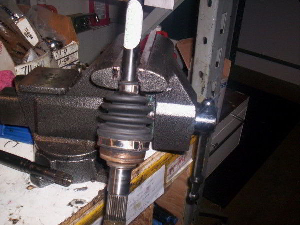
                CV joint in vice clamp
            

        </td>
    </tr><tr>
		<td>
        	<h4>Step 2</h4>
            Take a tac hammer and put it directly on the race, which is the part directly connected to the shaft.  

            Starting with soft blows, use a heavier hammer / mallet and start tapping on the tac hammer, gradually increasing in force. This will help line up the internal clip, and the heavier blows will help remove the joint.
        </td><td>
        	

                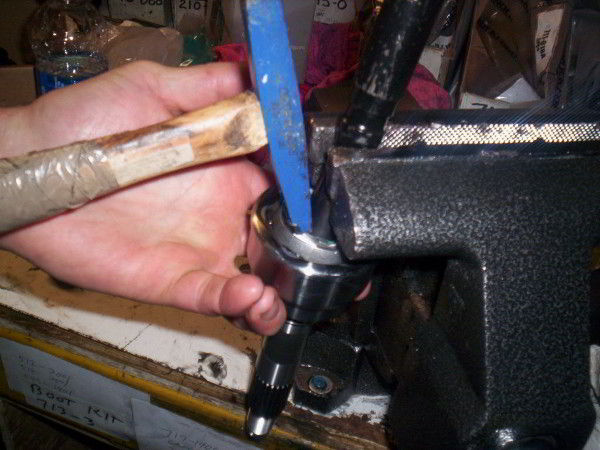
                Tap the race with a tac hammer
            

        </td>
    </tr>
</table>

---

## Inner CV Joint Disassembly

<table>
	<tr>
		<td>
        	<h4>Step 1</h4>
            To remove an inner CV joint from an CV axle, first cut off the old boot. If the boot is fine, and you want to reuse it, just pull it back towards the outer joint. After the boot is out of the way, clean any excess grease.
        </td><td>
        	

                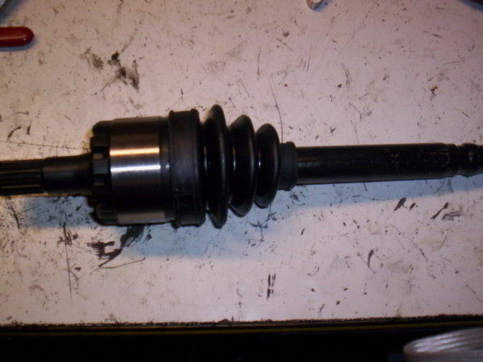
                CV joint with boot
            

        </td>
    </tr><tr>
		<td>
        	<h4>Step 2</h4>
            Once it is clean, you should be able to look inside the inner joint housing and see a "c" clip near the edge of the housing.
        </td><td>
        	

                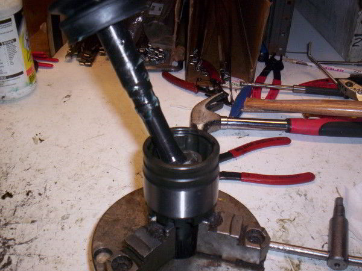
                Cleaned inner joint
            

        </td>
    </tr><tr>
		<td>
        	<h4>Step 3</h4>
            This can be removed by putting an utility knife or an flat head screw driver under the clip and flicking it off.
        </td><td>
        	

                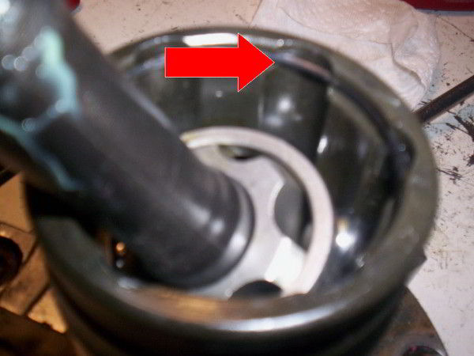
                C clip on inner joint
            

        </td>
    </tr><tr>
		<td>
        	<h4>Step 4</h4>
            Once the clip is removed, you can pull off the inner joint housing, and whats left on your shaft should be: the race, the cage, and the ball bearings.
        </td><td>
        	

                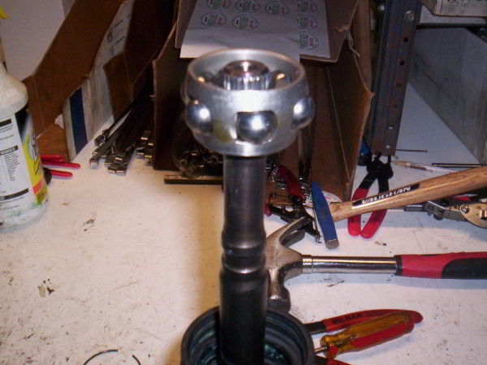
                Removed shaft
            

        </td>
    </tr><tr>
		<td>
        	<h4>Step 5</h4>
            If you look at the top on the race, you'll see a retaining clip. If you have retaining clip pliers, this can be removed easily. Spread open the clip and remove it, that will allow you to remove the race, cage, and ball bearings off the shaft.
        </td><td>
        	

                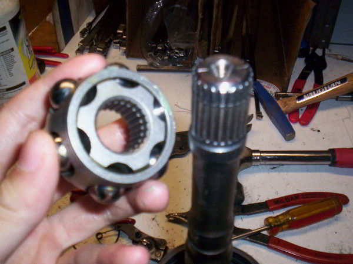
                Removed cage and race
            

        </td>
    </tr>
</table>

---

## Rebuilding CV joints

1. Once you have disassembled the CV joint from the axle shaft, place it in a vice with the splined end facing down.
2. Degrease the old housing and then look for contact wear in the area where the ball moves back and forth in the grooves. Housing wear is normal and increases with mileage. Rebuilding should not be performed when the wear pattern becomes extreme.
3. If you are reusing any part of the old race, cage, or ball bearings degrease them and also look for any wear, dimples, or pitting. You can check the cage for cracks by dropping the cage on a hard surface. It should make a pinging sound, if not look closely for a crack.
4. To reassemble the CV joint, place the race back into the cage. Align the race spherical lands with the cage windows.
5. Place the assembled cage and race back into the CV joint housing. For heavy duty units you want the thick side facing out
6. Now place one ball into the cage window and tap lightly on the cage while holding the race to keep it from moving out of position to make contact with the ball.
7. Once the ball is down into the track tap lightly on the cage and race toward the side of that ball to expose the next window and repeat the process until all of the balls are installed.
8. Remove the clip from the axle shaft and place the shaft into the CV joint
9. Rotate the axle shaft around (no more than a 30 angle) to check for the smoothness of operation in the CV joint.
10. Twist the shaft from side to side to check for looseness. It may have a little play just nothing excessive.
11. Remove the axle shaft.
12. Cut the corner of the grease packet and make it like a bakers bag.
13. Press the cut corner of the grease packet tightly into the hole were the axle shaft will go.
14. Squeeze until you see grease come up around the balls then set the packet aside for the next procedure.
15. Install the clip back on the axle shaft and place the boot for the CV joint onto the shaft. Slide the boot down to the other joint, so it is out of the way.
16. Place the axle shaft back into the CV joint by lining up the splines of the shaft with the ones on the CV joint and press downward. You'll want to use a screwdriver to push the clip inward while pressing down to get it centered.
17. Now give the shaft a light tap with a soft hammer and the shaft should slide in easily until you feel the clip catch. It's a good idea to try to pull the shaft out to make sure it securely seated correctly inside the CV joint.
18. Take the remaining grease and make a bead around the top of the joint, similar to how an ice cream cone is shaped.
19. Now slide the boot down and tighten the large clamp.
20. Before you tighten the small clamp, put a screw driver in between the shaft and the boot to allow any trapped air to escape then remove it and install the small clamp.
21. If replacing the other CV joint, repeat the above steps for it. Otherwise, the axle is ready to be put back into the vehicle.

---

## Disassembly of a "Non-Rebuildable" U-Joint

<table>
	<tr>
		<td>
        	<h4>Step 1</h4>
            Use a press or hammer to force the bearing cap out of the staked ear hold. This may require considerable force, but be careful not to damage the ear holes or bend the yoke or flange ears.
        </td><td>
        	

                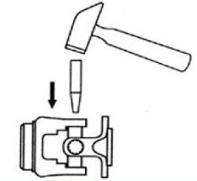
                
            

        </td>
    </tr><tr>
		<td>
        	<h4>Step 2</h4>
            Use a vise or pliers to remove the bearing cap which is exposed on the opposite side. Twisting the pliers back and forth while pulling may help unseat the cap.
        </td><td>
        	

                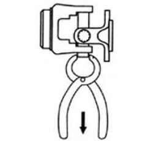
                
            

        </td>
    </tr><tr>
		<td>
        	<h4>Step 3</h4>
			Use a small grinding wheel to smooth the staked ear hole on the driven side in order to make the removal of the opposite bearing cap easier.  

			Repeat the above steps to remove the remaining bearing caps. Once all the caps are removed, discard the used joint.  

			Inspect the yoke and flange for damage, cleaning out the remaining staked tabs and any excessive burs. This will help make installing the new caps easy.
        </td><td>
        	

                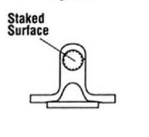
                
            

        </td>
    </tr>
</table>

---

## Installation of a "Non-Rebuildable" U-Joint

<table>
	<tr>
		<td>
        	<h4>Step 1</h4>
            Press the new U-Joint and bearing caps into position and insert the "C" clip
        </td><td>
        	

                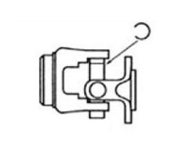
                
            

        </td>
    </tr><tr>
		<td>
        	<h4>Step 2</h4>
            Use a press or hammer to expose the opposite slot, then insert the second clip.  
			Repeat the above steps for the remaining clips.  
			Make sure all the clips are completely seated into the groove of the new bearing caps
        </td><td>
        	

                
                
            

        </td>
    </tr>
</table>
