
## Installing Pinch-Type Bands

<table>
	<tr>
    	<td>
        	<h4>Needed Tools</h4>
            When installing your new pinch type bands, you will need either a tile snipper or a band crimping tool.
		</td><td>
        	

                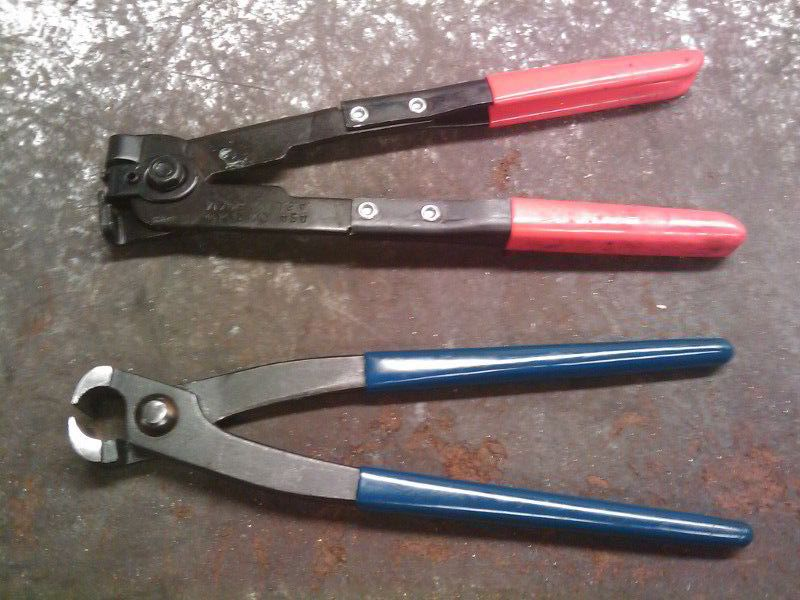
                Tools Needed
            

	    </td>
	</tr><tr>
		<td>
        	<h4>Step 1</h4>
			Start by wrapping the band around your boot once its seated on your joint.
			While this guide shows the inner joint, this guide works with the outer too.
			Looking at the band, you will notice it has notches and tabs. Hand tighten the band by squeezing the band and locking your tabs into your notches as tight as possible.
        </td><td>
        	

                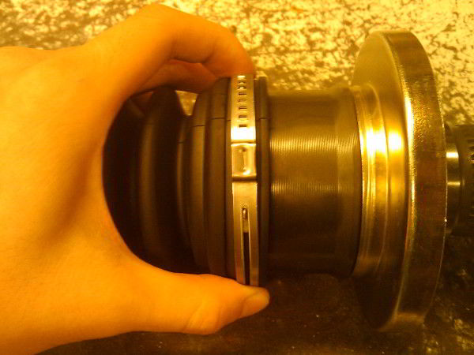
                Hand Tighten
            

        </td>
	</tr><tr>
		<td>
        	<h4>Step 2</h4>
        	Notice there is a little box tab that protrudes out more than the other tabs. You will want to take your tool and pinch the sides of that little box.
        </td><td>
        	

                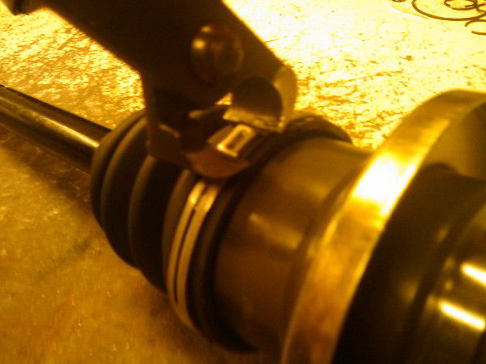
                Pitch the box tab
            

        </td>
    </tr><tr>
		<td>
        	<h4>Step 3</h4>
            Once you have pinched the box tab, it should mushroom up as seen in the picture.
        </td>
        <td>
        	

                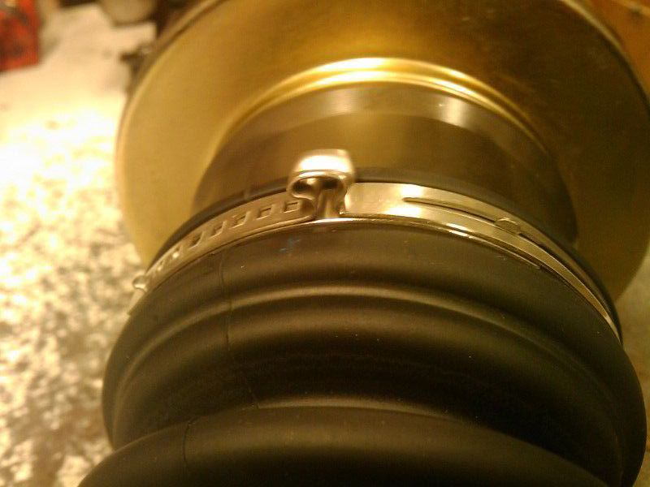
                After Pinching
            

        </td>
	</tr><tr>
		<td>
        	<h4>Step 4</h4>
			The last thing you want to do is grab a small tac hammer and just tap down the mushroomed tab till its flat, just in case there are clearence issues.
        </td><td>
        	

                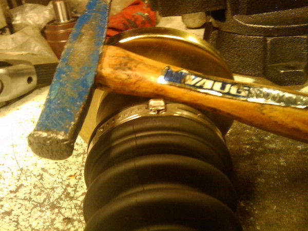
                Hammer tab flat
            

        </td>
	</tr>
</table>

---

## Using the Economy Banding Tool

<table>
	<tr>
		<td>
        	<h4>Step 1</h4>
            Wrap the clamp around the CV boot and thread the tail through the buckle. Draw it tight.
        </td><td>
        	

                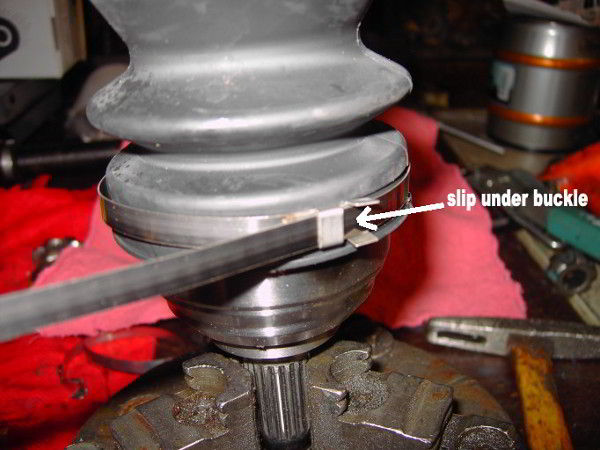
                Slip tail under buckle and draw tight
            

        </td>
    </tr><tr>
		<td>
        	<h4>Step 2</h4>
            Helpful Tip: Bend the excess tail backwards to hold it in
        </td><td>
        	

                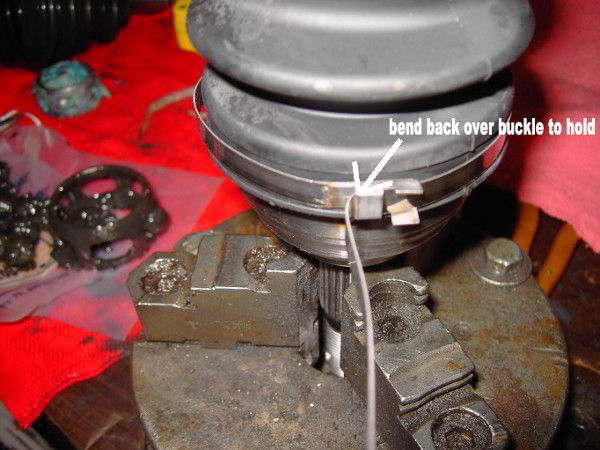
                Bend excess back to hold
            

    	</td>
	</tr><tr>
		<td>
        	<h4>Step 3</h4>
            Insert the tail of the clamp into the head of the banding tool and slide it through the slot of the winding mandrel.
        </td><td>
        	

                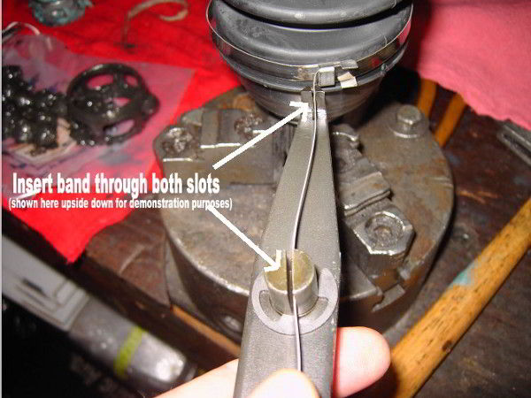
                Attach banding tool
            

        </td>
	</tr><tr>
		<td>
        	<h4>Step 4</h4>
            Tension the clamp with a clockwise motion using a &frac34;&quot; socket wrench.
        </td><td>
			

                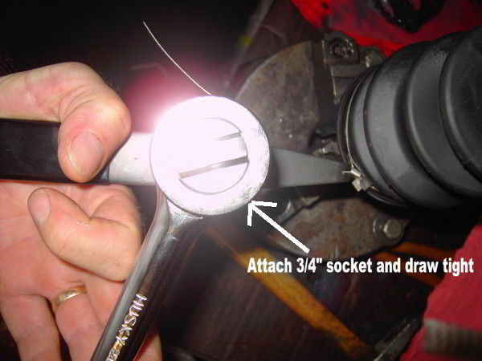
                Tighten the banding tool
            

        </td>
	</tr><tr>
		<td>
        <h4>Step 5</h4>
        After sufficient tension has been applied (the clamp is tight enough to hold the boot from turning on the joint but not too tight that the boot is damaged), lever the tool back over the buckle to put a bend in the clamp to hold the tension (you may want to tap it with a hammer to put a good crease).
    	</td><td>
			

                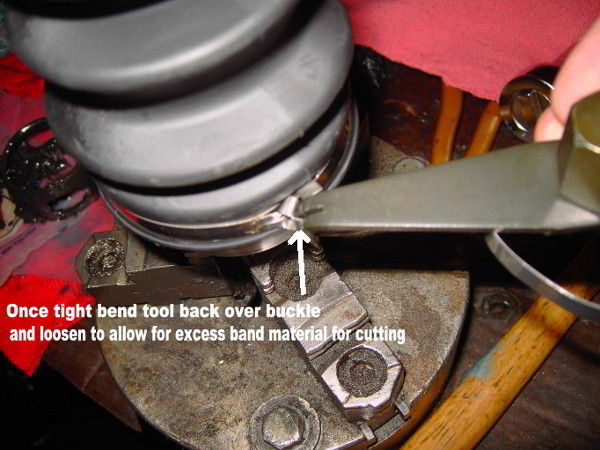
                Bend back clamp
            

    	</td>
    </tr><tr>
		<td>
        	<h4>Step 6</h4>
            Complete clamp installation by tapping down the tail of the clamp against the buckle and then tapping down the buckle ears to hold the clamp tail. Cut off excess band with the tin cutter.
        </td><td>
        	

                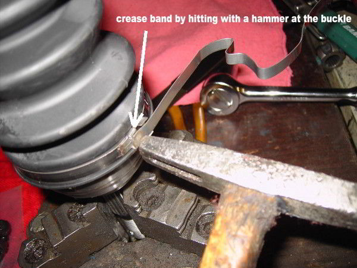
                Tap down the ears
            

        </td>
	</tr>
</table>

---

## Using the Professional Banding Tool

<table>
	<tr>
		<td>
        	<h4>Step 1</h4>
            Wrap the clamp around the CV boot and thread the tail through the buckle. Draw it tight.
        </td><td>
        	

                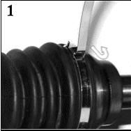
                Slip tail under buckle and draw tight
            

        </td>
    </tr><tr>
		<td>
        	<h4>Step 2</h4>
           	Insert the tail of the clamp into the head of the banding tool and slide it through the slot of the winding mandrel.
        </td><td>
        	

                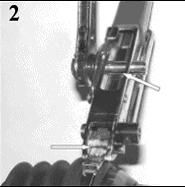
                Insert tail into the winding mandrel
            

        </td>
    </tr><tr>
		<td>
        	<h4>Step 3</h4>
           	Depress the locking pawl and tension the clamp with a clockwise motion of the ratchet.
        </td><td>
        	

                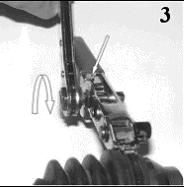
                Tighten via the ratchet
            

        </td>
    </tr><tr>
		<td>
        	<h4>Step 4</h4>
           	After sufficient tension has been applied (the clamp is tight enough to hold the boot from turning on the joint but not too tight that the boot is damaged), lever the tool back over the buckle to put a bend in the clamp to hold the tension (you may want to tap it with a hammer to put a good crease).
        </td><td>
        	

                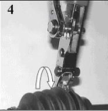
                Bend buckle back to hold
            

        </td>
    </tr><tr>
		<td>
        	<h4>Step 5</h4>
           	Cut off excess band with the cutter and remove the tool.
        </td><td>
        	

                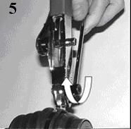
                Cut off excess and remove tool
            

        </td>
    </tr><tr>
		<td>
        	<h4>Step 6</h4>
           	Complete clamp installation by tapping down the tail of the clamp against the buckle and then tapping down the buckle ears to hold the clamp tail.  Remove excess band from the tool by lifting the locking pawl and removing the ratchet.
        </td><td>
        	

                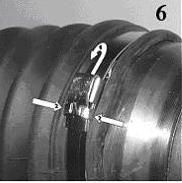
                Tap down the ears to hold the tail in place
            

        </td>
    </tr>
</table>

---

## Installing Split Boots or Bolt-On Boots

1. Raise vehicle onto jack stands.
2. Remove old retaining clamps by twisting ear with wire cutters or a screwdriver. Do not reuse the old clamps.
3. Early GM applications can have a large metal retaining ring. Remove ring by sliding it off the CV joint using a pry bar or large screwdriver, use care to avoid damage to ring, re-use old rings.
4. Cut away old boot using a utility knife.
5. Once area is exposed clean entire joint using a clean dry rag.
6. Inspect joint for damage before proceeding.
7. Make small cut on corner of grease bag and squeeze as much grease as possible on large end of joint around the cage, race, and balls avoiding any on the sealing surface of the joint.
8. Place boot around joint and shaft.
9. Press bolts through tabs and install nuts. Do not over tighten the hardware.
10. Squeeze all excess grease into large end of boot.
11. On early GM applications with metal retaining ring you will need to assemble boot, then place metal ring over new boot.
12. Slide metal retaining ring down joint using a small hammer. Do not hit the CV boot, only the ring.
13. Install new clamps provided in kit, wrap them as tight as possible by hand and then use an end cutter, side cutter, or tile snips to crimp them tight. After clamps are in place, the installation is complete.
