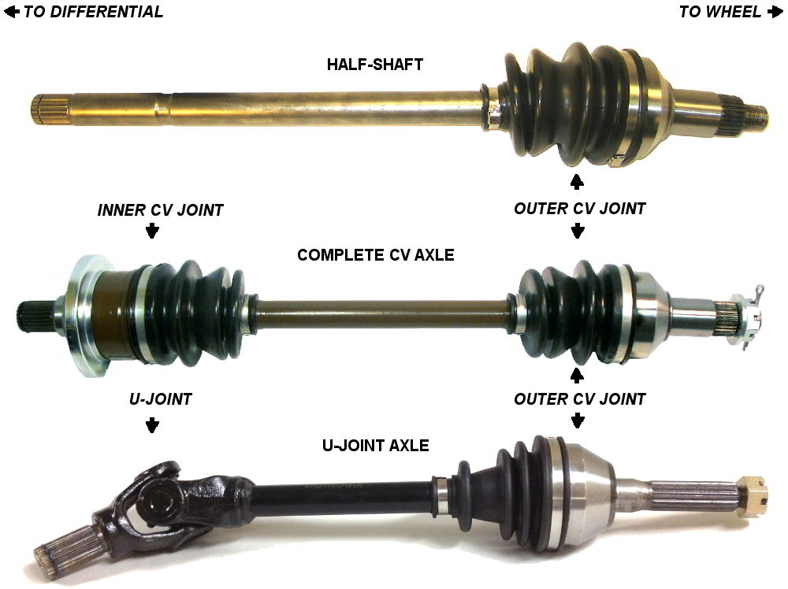

### Halfshafts
A halfshaft only has the outer CV joint assembled onto an axle shaft. The user then has to assemble a inner joint that they already have onto the halfshaft to make a complete CV axle. Compare this to a complete CV axle which has both the outer and inner joints fully assembled.  
            
### Complete CV axles
A CV axle is located between the wheel and differential, sometimes it is incorrectly called a halfshaft. On four wheel vehicles there are four CV axles. A CV axle includes the inner and outer CV joints completely assembled onto a axle shaft.  
            
### U-Joints
A complete CV axle has two CV joints for the inner and outer joints. An u-joint axle has one CV joint on the outer joint and an u-joint for the inner joint.

	
	

