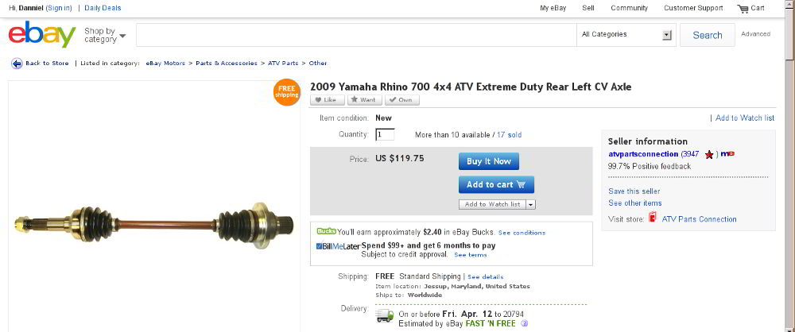

### Step 1
If you wish to order a eBay listing over the phone you will need to find its item number. To start find the listing on eBay you wish to purchase.

	
	Item Page

### Step 2
Scroll down until you see the "Description" and "Shipping and payments" tabs. It should be beneath the image of the item. </td>

	
	Description Tab

### Step 3
The item number is on the far right, beneath the "Description" and "Shipping and payments" tabs. It should be a 12 digit number and is clearly labled "Item number:" In this photo the item number is 300826701813.</td>

	
	Item Number

