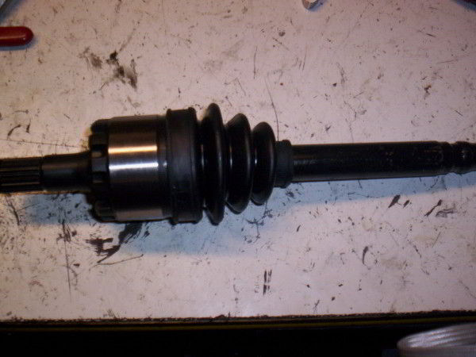
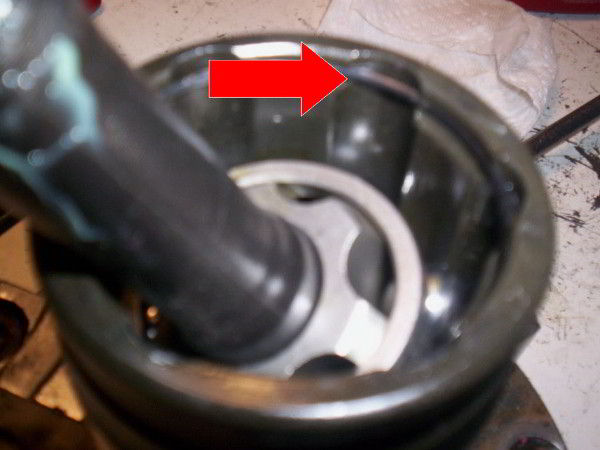
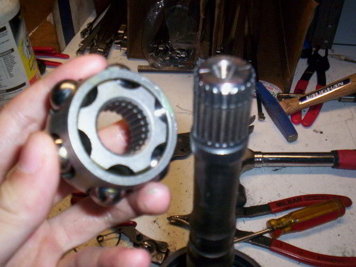

### Step 1
To remove an inner CV joint from an CV axle, first cut off the old boot. If the boot is fine, and you want to reuse it, just pull it back towards the outer joint. After the boot is out of the way, clean any excess grease.

	
	CV joint with boot

### Step 2
Once it is clean, you should be able to look inside the inner joint housing and see a "c" clip near the edge of the housing.

	
	Cleaned inner joint

### Step 3
This can be removed by putting an utility knife or an flat head screw driver under the clip and flicking it off.

	
	C clip on inner joint

### Step 4
Once the clip is removed, you can pull off the inner joint housing, and whats left on your shaft should be: the race, the cage, and the ball bearings.

	
	Removed shaft

### Step 5
If you look at the top on the race, you'll see a retaining clip. If you have retaining clip pliers, this can be removed easily. Spread open the clip and remove it, that will allow you to remove the race, cage, and ball bearings off the shaft.

	
	Removed cage and race

