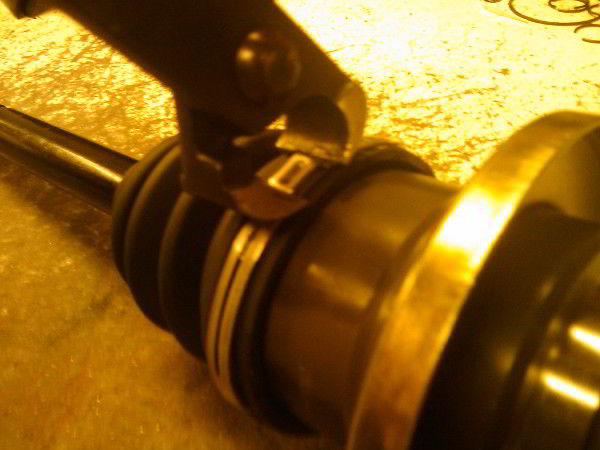

### Needed Tools
When installing your new pinch type bands, you will need either a tile snipper or a band crimping tool.

	
	Tools Needed

### Step 1
Start by wrapping the band around your boot once its seated on your joint.
While this guide shows the inner joint, this guide works with the outer too.
Looking at the band, you will notice it has notches and tabs. Hand tighten the band by squeezing the band and locking your tabs into your notches as tight as possible.

	
	Hand Tighten

### Step 2
Notice there is a little box tab that protrudes out more than the other tabs. You will want to take your tool and pinch the sides of that little box.

	
	Pitch the box tab

### Step 3
Once you have pinched the box tab, it should mushroom up as seen in the picture.

	
	After Pinching

### Step 4
The last thing you want to do is grab a small tac hammer and just tap down the mushroomed tab till its flat, just in case there are clearence issues.

	
	Hammer tab flat

