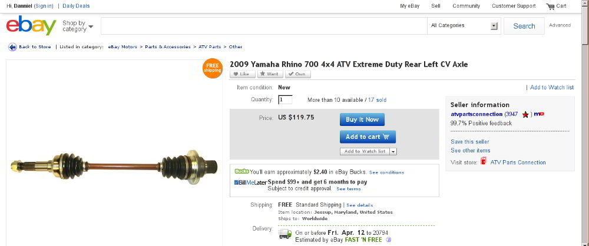
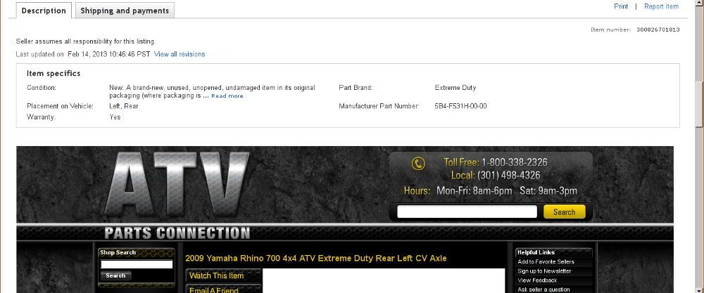
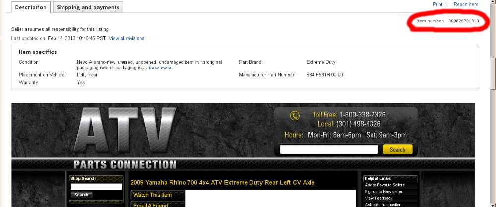

### Where to find the eBay item number?

<table>
    <tr>
        <td>
        	<h4>Step 1</h4>
            If you wish to order a eBay listing over the phone you will need to find its item number. To start find the listing on eBay you wish to purchase.
        </td><td>
            

                
                Item Page
            

        </td>
    </tr><tr>
    	<td>
        	<h4>Step 2</h4>
        	Scroll down until you see the "Description" and "Shipping and payments" tabs. It should be beneath the image of the item. </td>
        <td>
            

                
                Description Tab
            

        </td>
    </tr><tr>
    	<td>
        	<h4>Step 3</h4>
        	The item number is on the far right, beneath the "Description" and "Shipping and payments" tabs. It should be a 12 digit number and is clearly labled "Item number:" In this photo the item number is 300826701813.</td>
        <td>
            

                
                Item Number
            

        </td>
    </tr>
</table>

---

### Choosing the correct side: right or left?

To choose the correct side for an axle you should pick the side as you are sitting on the vehicle. For instance, if you are sitting on the vehicle and the left side axle needs to be replaced, you should order a left side, not a right. Never choose a side based on looking at the ATV from the front.

---

### Finding the VIN

A Vehicle Identification Number (VIN) is an unique 17 digit number made out of letters and numbers that contains a lot of information about that vehicle such as where and when it was made.

Vehicles made at the end of the year are often labeled as being manufactured in the upcoming year even though the two years use different parts. Split year vehicles also use different parts but are made in the same year. In this case you will need to know the month of the manufacture date. Both these problems are typically not apparent, so a VIN can confirm the exact date of manufacture.

By law, all ATVs and UTVs must be issued a VIN. Every vehicle made or sold in the US since 1971 has one. Its location is different between each OEM, but can always be found somewhere permanent. Typically, it is stamped on the frame or a metal plate near the frame.

If you cannot find the VIN, try searching online for the location of the VIN on your particular vehicle or contact the manufacturer and ask them for it's location.

If you do contact the manufacturer, it's best to ask them to decode it for you. We have access to general tools to decode VINs but they are not as sophisticated and detailed as the manufacturer's decoder

#### Common VIN Locations

* Left hand side below the motor, but ***not on the motor*** as that is a different serial number
* Top of the steering shaft
* Behind the brush guard
* Behind the air filter
* On the swingarm bearings
* Near the A-Arm mounts

---

### How is the shipping fee determined?

The shipping fee is determined by the carrier (UPS, FedEx, USPS) and is dependant on the shipping address and weight of the package. Unfortunately, we do not control the fee charged by the shipping carriers.

While we do carry some small parts, most of the parts such as complete CV axles are awkwardly shaped and therefore do not fit into flat rate packaging. Many of the parts weigh much more than an usual package. For instance, CV axles are almost entirely made out of steel and can weigh more than 10 pounds.

Shipping fees also tend to double when special services such as overnight delivery are needed. It is not unusual for a package to have shipping fees over $100 when some of these services are requested.

---

### When can I expect my package?

Orders placed Monday - Friday before 4pm <abbr title="Eastern Standard Time">EST</abbr> are processed and shipped out on the same day. Any order placed after 4pm EST will ship out the next business day. Orders placed on Fridays at 4pm and after will be shipped on the following Monday.

Transit times vary depending on the carrier and shipping destination.

* Domestic orders are sent via FedEx, UPS, or USPS:
	* Orders placed over the phone
		* "Free Shipping" typically arrive between 5 to 7 business days 1
	    * Specific shipping services are available upon request
	* Orders placed online (Amazon, eBay, Web Store)
		* "Standard Shipping" typically arrive between 5 to 7 business days 1
	    * "Expedited Shipping" typically arrive between 3 to 5 business days 1
	    * "One-day Shipping" will arrive the next business day once the package is shipped 1
* All International orders are sent via USPS or UPS:
	* Typical transit times are 6 to 10 business days 2

#### Disclaimers
1. Transit time are estimates and are not guaranteed. To ensure the package arrives on or before a specific date, please place the order over the phone and specify the needed delivery date. You may have to pay an additional shipping charge.
2. Transit time are estimates and are not guaranteed. Shipping transit times vary depending on the country, customs, clearance, and local postal services. Unfortunately, these factors are outside of our control; we cannot offer a guaranteed delivery date.

---

### Shipping: Tracking a package

An unique tracking number is generated by our shipping carriers to track your package's status from the warehouse to your shipping address. It is generated after the carrier picks the package up from our warehouse. If you provided an email address, this tracking number will automatically be emailed to you.

To track your package, type the tracking number into <a href="http://www.google.com">Google</a>. Alternatively, go to the carrier's website and visit the tracking number page. For convenience, the direct links those pages are listed below as well as a description of each carrier's tracking number format:

* [UPS](http://www.ups.com/tracking/tracking.html) - 18 characters long starting with "1Z" followed by a 16 digit number
* [FedEx](https://www.fedex.com/fedextrack/") - 15 digit number
* [USPS](https://www.usps.com/shipping/trackandconfirm.htm) - 22 characters long

*If you have not received the tracking number after the package has shipped, feel free to [contact us](?contact).*
