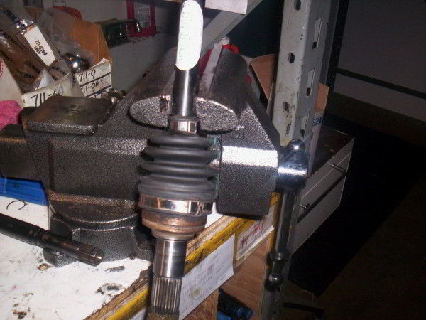

### Step 1
The outer CV joint is the harder of the two joint to remove. First, remove the boot or push it back if you still intend to use it. Set the bar up in a vice, so that the outer joint is facing towards the ground.

	
	CV joint in vice clamp

### Step 2
Take a tac hammer and put it directly on the race, which is the part directly connected to the shaft.
            
 

Starting with soft blows, use a heavier hammer / mallet and start tapping on the tac hammer, gradually increasing in force. This will help line up the internal clip, and the heavier blows will help remove the joint.

	
	Tap the race with a tac hammer

