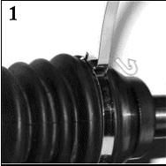
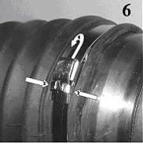

### Step 1
Wrap the clamp around the CV boot and thread the tail through the buckle. Draw it tight.

	
	Slip tail under buckle and draw tight

            
### Step 2
Insert the tail of the clamp into the head of the banding tool and slide it through the slot of the winding mandrel.

	
	Insert tail into the winding mandrel

### Step 3
Depress the locking pawl and tension the clamp with a clockwise motion of the ratchet.

	
	Tighten via the ratchet

### Step 4
After sufficient tension has been applied (the clamp is tight enough to hold the boot from turning on the joint but not too tight that the boot is damaged), lever the tool back over the buckle to put a bend in the clamp to hold the tension (you may want to tap it with a hammer to put a good crease).

	
	Bend buckle back to hold

### Step 5
Cut off excess band with the cutter and remove the tool.

	
	Cut off excess and remove tool

### Step 6
Complete clamp installation by tapping down the tail of the clamp against the buckle and then tapping down the buckle ears to hold the clamp tail.  Remove excess band from the tool by lifting the locking pawl and removing the ratchet.

	
	Tap down the ears to hold the tail in place

