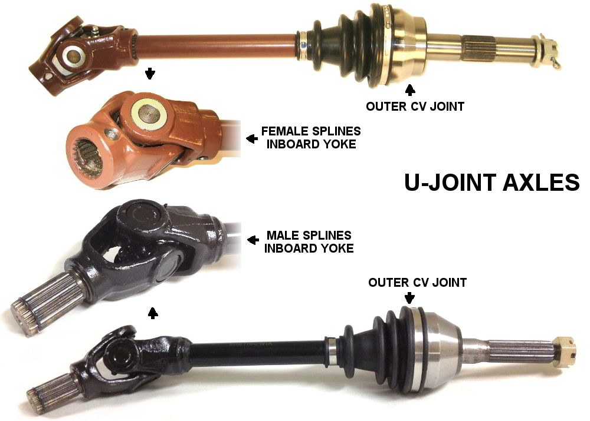

## What are C.V. Joints?

<table>
	<tr>
     	<td>
			A <strong>C</strong>onstant <strong>V</strong>elocity joint (CV Joint) is one of the types of joints used on a vehicle's axle. The other type, called an U-Joint is different from a CV Joint, however most u-joint axles also have one CV joint (however a few axles use only u-joints). A CV joint is made up of the housing, race, cage, and balls.
        </td>
        <td>
			

                
                
            

        </td>
     </tr>
</table>

---

## Inner vs outer joints

<table>
     <tr>
    	<td>
    		A CV axle includes two CV joints: the inner and outer joints. The inner joint is the side closest to the differential, whereas the outer joint is the one closest to the wheel.
    	</td>
		<td>
			

                
                
            

        </td>
     </tr>
</table>

---

## Differences between Halfshafts, Complete C.V. axles, and a U-Joints
<table>
     <tr>
     	<td>
    		<h4>Halfshaft</h4>
			A halfshaft only has the outer CV joint assembled onto an axle shaft. The user then has to assemble a inner joint that they already have onto the halfshaft to make a complete CV axle. Compare this to a complete CV axle which has both the outer and inner joints fully assembled.  
            
            <h4>Complete CV axle</h4>
            A CV axle is located between the wheel and differential, sometimes it is incorrectly called a halfshaft. On four wheel vehicles there are four CV axles. A CV axle includes the inner and outer CV joints completely assembled onto a axle shaft.  
            
            <h4>U-Joints</h4>
    		A complete CV axle has two CV joints for the inner and outer joints. An u-joint axle has one CV joint on the outer joint and an u-joint for the inner joint.
        </td><td>
			

                
                
            

        </td>
     </tr>
</table>

---

## Female vs male splines on U-Joint Axles
<table>
	<tr>
     	<td>
   			A U-Joint axle has one CV joint on the outboard and a universal joint and yoke assembly on the inboard. The u-joint yoke may have male or female type splines depending on the axle. Male splines have a rod that goes into the differential. Female splines have an opening in which a rod from the differential goes into. This illustration compares the two.
        </td><td>
			

                
                
            

        </td>
     </tr>
</table>

---

## Avoiding the "Driveshaft" Ambiguity

A driveshaft can refer to one of a few different parts. Industry terms are different from manufacturer to manufacturer. For this reason, it is best to avoid using the term "driveshaft" to describe any vehicle part. Instead, use more specific terms that tend not to be confused such as "complete CV axle" or "propshaft".

---

## Propshafts

Propshafts are located between the front and rear differentials. Depending on the vehicle, it may have one or two propshafts. 2x4 vehicles will only have one propshaft, while 4x4 vehicles will have two.
