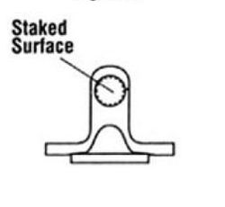

### Step 1
Use a press or hammer to force the bearing cap out of the staked ear hold. This may require considerable force, but be careful not to damage the ear holes or bend the yoke or flange ears.
        

	
	

### Step 2
Use a vise or pliers to remove the bearing cap which is exposed on the opposite side. Twisting the pliers back and forth while pulling may help unseat the cap.
        

	
	

### Step 3
Use a small grinding wheel to smooth the staked ear hole on the driven side in order to make the removal of the opposite bearing cap easier.
 

Repeat the above steps to remove the remaining bearing caps. Once all the caps are removed, discard the used joint.
 

Inspect the yoke and flange for damage, cleaning out the remaining staked tabs and any excessive burs. This will help make installing the new caps easy.

	
	

