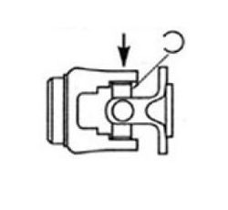

### Step 1
Press the new U-Joint and bearing caps into position and insert the "C" clip

    
    

### Step 2
Use a press or hammer to expose the opposite slot, then insert the second clip.
 

Repeat the above steps for the remaining clips.
 

Make sure all the clips are completely seated into the groove of the new bearing caps

    
    

