## Ordering Questions

* [Ordering: Where to find the eBay item number?](/?howto-ordering#ebay)
* [Choosing the correct side: right or left?](/?howto-ordering#left-or-right)
* [Finding the VIN](/?howto-ordering#vin)
* [How is the shipping fee determined?](/?howto-ordering#shipping-fee)
* [When can I expect my package?](/?howto-ordering#shipping-time)
* [Tracking a package](/?howto-ordering#tracking)

<!-- 
## Helmet Sizing Charts

* [Street Helmets](/?howto-helmet-sizing#street)
* [Dirt Bike &amp; ATV Helmets](/?howto-helmet-sizing#dirt-and-atv)
-->

## Terminology

<table>
	<tr>
     	<td>
        	<h4>CV Joints</h4>
			A <strong>C</strong>onstant <strong>V</strong>elocity joint (CV Joint) is one of the types of joints used on a vehicle's axle. The other type, called an U-Joint is different from a CV Joint, however most u-joint axles also have one CV joint (however a few axles use only u-joints). A CV joint is made up of the housing, race, cage, and balls.
        </td>
        <td>
			

                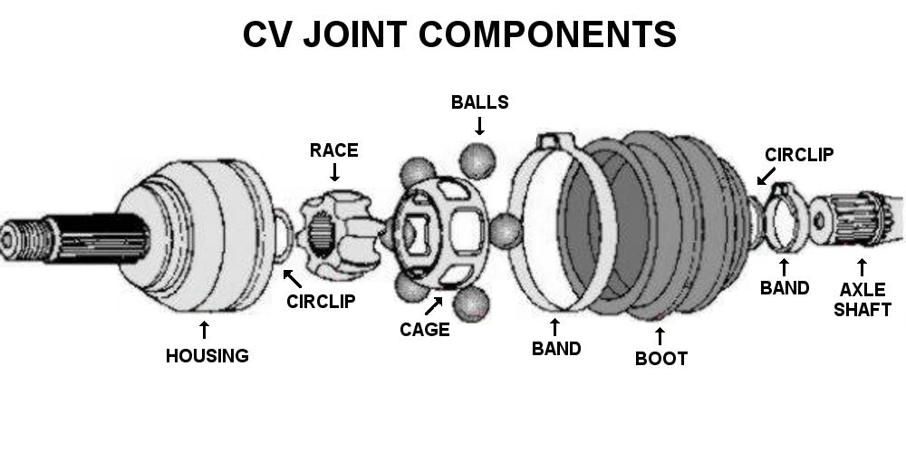
                
            

        </td>
     </tr><tr>
    	<td>
            <h4>Inner vs outer joints</h4>
    		A CV axle includes two CV joints: the inner and outer joints. The inner joint is the side closest to the differential, whereas the outer joint is the one closest to the wheel.
    	</td>
		<td>
			

                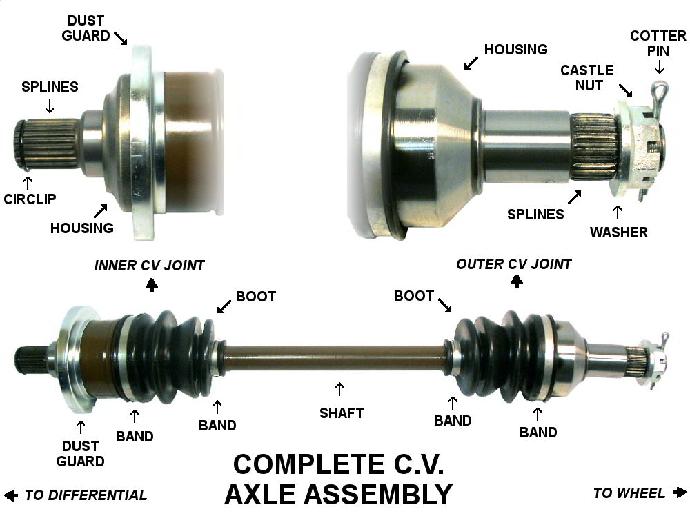
                
            

        </td>
     </tr><tr>
     	<td>
    		<h4>Halfshaft</h4>
			A halfshaft only has the outer CV joint assembled onto an axle shaft. The user then has to assemble a inner joint that they already have onto the halfshaft to make a complete CV axle. Compare this to a complete CV axle which has both the outer and inner joints fully assembled.  
            
            <h4>Complete CV axle</h4>
            A CV axle is located between the wheel and differential, sometimes it is incorrectly called a halfshaft. On four wheel vehicles there are four CV axles. A CV axle includes the inner and outer CV joints completely assembled onto a axle shaft.  
            
            <h4>U-Joints</h4>
    		A complete CV axle has two CV joints for the inner and outer joints. An u-joint axle has one CV joint on the outer joint and an u-joint for the inner joint.
        </td><td>
			

                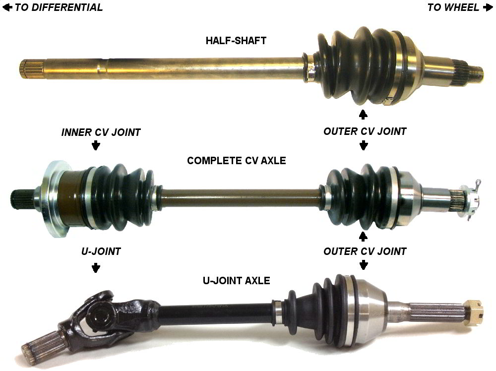
                
            

        </td>
     </tr><tr>
     	<td>
			<h4>Female vs male splines on U-Joint Axles</h4>
   			A U-Joint axle has one CV joint on the outboard and a universal joint and yoke assembly on the inboard. The u-joint yoke may have male or female type splines depending on the axle. Male splines have a rod that goes into the differential. Female splines have an opening in which a rod from the differential goes into. This illustration compares the two.
        </td><td>
			

                
                
            

        </td>
     </tr>
</table>

#### Driveshafts

A driveshaft can refer to one of a few different parts. Industry terms are different from manufacturer to manufacturer. For this reason, it is best to avoid using the term "driveshaft" to describe any vehicle part. Instead, use more specific terms that tend not to be confused such as "complete CV axle" or "propshaft".

 

#### Propshafts

Propshafts are located between the front and rear differentials. Depending on the vehicle, it may have one or two propshafts. 2x4 vehicles will only have one propshaft, while 4x4 vehicles will have two.

---
    
### Returns: What is your warranty and returns policy?

ATV Parts Connection proudly stands behind our products with an fair, brief, and easy to understand, warranty policy. You can find it on our [store policies](/?policies#warranty") page. 
 

### Returns: The item I recieved is a different color than the picture

We use a variety of different manufacturers who sometimes use different color schemes (typically brown or black) for products. Depending on availability of the product, the color may be different from the one that is pictured in the listing.

Often a part will be a different color if the part was not in stock and was automatically upgraded to a better grade part that was in stock. For example, an out of stock OE Type CV Axle might be substituted with a Heavy Duty CV Axle at no additional cost to the customer.

### Returns: The part I ordered does not fit on my vehicle</dt>

We strive to correctly ship every order. Unfortunately, rare circumstances do arise such as incorrectly shipped parts. In the event this occurs, make sure you have access to the following information before [contacting us](/?contact):
		
* **Sales Number** - the sales number will allow us to quickly pull up your order from our computer system. You can find it at the top right of your sales receipt
* **Year, Make, Model** - The fitment information will allow us to confirm what is the correct part for your vehicle. The model should include the engine size. For instance, "Polaris Sportsman 500" might refer to 3 different vehicles which take different parts: "Polaris Sportsman 500", "Polaris Sportsman 500 H.O.", and "Polaris Sportsman 500 X2".
* **Packaging** - Most packaging we use have a part number on one of the ends that can be compared to the actual part ordered. 
* **VIN** - The Vehicle Identification Number can provide useful information that can help in determining the correct part.
* **Pictures** - We might need to see a comparison of the part received versus the original to determine the correct part.

## Changing Bands on a Boot

### Installing Pinch-Type Bands

<table>
	<tr>
    	<td>
        	<h4>Needed Tools</h4>
            When installing your new pinch type bands, you will need either a tile snipper or a band crimping tool.
		</td><td>
        	

                
                Tools Needed
            

	    </td>
	</tr><tr>
		<td>
        	<h4>Step 1</h4>
			Start by wrapping the band around your boot once its seated on your joint.
			While this guide shows the inner joint, this guide works with the outer too.
			Looking at the band, you will notice it has notches and tabs. Hand tighten the band by squeezing the band and locking your tabs into your notches as tight as possible.
        </td><td>
        	

                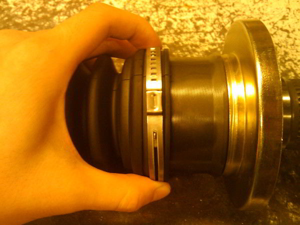
                Hand Tighten
            

        </td>
	</tr><tr>
		<td>
        	<h4>Step 2</h4>
        	Notice there is a little box tab that protrudes out more than the other tabs. You will want to take your tool and pinch the sides of that little box.
        </td><td>
        	

                
                Pitch the box tab
            

        </td>
    </tr><tr>
		<td>
        	<h4>Step 3</h4>
            Once you have pinched the box tab, it should mushroom up as seen in the picture.
        </td>
        <td>
        	

                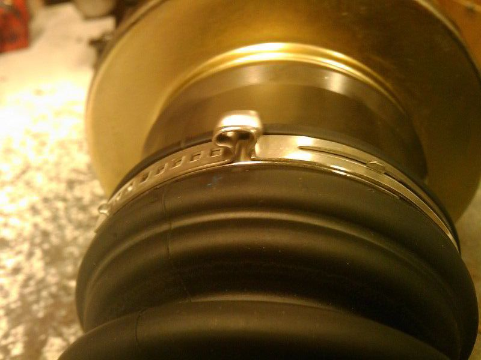
                After Pinching
            

        </td>
	</tr><tr>
		<td>
        	<h4>Step 4</h4>
			The last thing you want to do is grab a small tac hammer and just tap down the mushroomed tab till its flat, just in case there are clearence issues.
        </td><td>
        	

                
                Hammer tab flat
            

        </td>
	</tr>
</table>

### Using the Economy Banding Tool

<table>
	<tr>
		<td>
        	<h4>Step 1</h4>
            Wrap the clamp around the CV boot and thread the tail through the buckle. Draw it tight.
        </td><td>
        	

                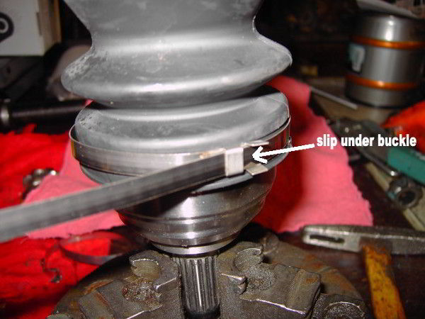
                Slip tail under buckle and draw tight
            

        </td>
    </tr><tr>
		<td>
        	<h4>Step 2</h4>
            Helpful Tip: Bend the excess tail backwards to hold it in
        </td><td>
        	

                
                Bend excess back to hold
            

    	</td>
	</tr><tr>
		<td>
        	<h4>Step 3</h4>
            Insert the tail of the clamp into the head of the banding tool and slide it through the slot of the winding mandrel.
        </td><td>
        	

                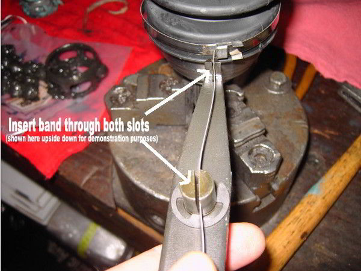
                Attach banding tool
            

        </td>
	</tr><tr>
		<td>
        	<h4>Step 4</h4>
            Tension the clamp with a clockwise motion using a &frac34;&quot; socket wrench.
        </td><td>
			

                
                Tighten the banding tool
            

        </td>
	</tr><tr>
		<td>
        <h4>Step 5</h4>
        After sufficient tension has been applied (the clamp is tight enough to hold the boot from turning on the joint but not too tight that the boot is damaged), lever the tool back over the buckle to put a bend in the clamp to hold the tension (you may want to tap it with a hammer to put a good crease).
    	</td><td>
			

                
                Bend back clamp
            

    	</td>
    </tr><tr>
		<td>
        	<h4>Step 6</h4>
            Complete clamp installation by tapping down the tail of the clamp against the buckle and then tapping down the buckle ears to hold the clamp tail. Cut off excess band with the tin cutter.
        </td><td>
        	

                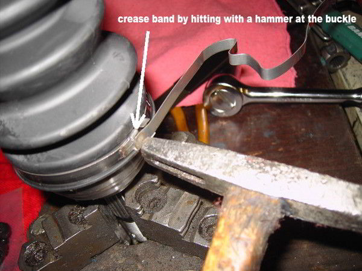
                Tap down the ears
            

        </td>
	</tr>
</table>

---

### Using the Professional Banding Tool

<table>
	<tr>
		<td>
        	<h4>Step 1</h4>
            Wrap the clamp around the CV boot and thread the tail through the buckle. Draw it tight.
        </td><td>
        	

                
                Slip tail under buckle and draw tight
            

        </td>
    </tr><tr>
		<td>
        	<h4>Step 2</h4>
           	Insert the tail of the clamp into the head of the banding tool and slide it through the slot of the winding mandrel.
        </td><td>
        	

                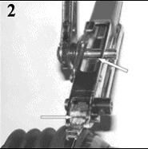
                Insert tail into the winding mandrel
            

        </td>
    </tr><tr>
		<td>
        	<h4>Step 3</h4>
           	Depress the locking pawl and tension the clamp with a clockwise motion of the ratchet.
        </td><td>
        	

                
                Tighten via the ratchet
            

        </td>
    </tr><tr>
		<td>
        	<h4>Step 4</h4>
           	After sufficient tension has been applied (the clamp is tight enough to hold the boot from turning on the joint but not too tight that the boot is damaged), lever the tool back over the buckle to put a bend in the clamp to hold the tension (you may want to tap it with a hammer to put a good crease).
        </td><td>
        	

                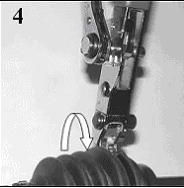
                Bend buckle back to hold
            

        </td>
    </tr><tr>
		<td>
        	<h4>Step 5</h4>
           	Cut off excess band with the cutter and remove the tool.
        </td><td>
        	

                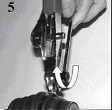
                Cut off excess and remove tool
            

        </td>
    </tr><tr>
		<td>
        	<h4>Step 6</h4>
           	Complete clamp installation by tapping down the tail of the clamp against the buckle and then tapping down the buckle ears to hold the clamp tail.  Remove excess band from the tool by lifting the locking pawl and removing the ratchet.
        </td><td>
        	

                
                Tap down the ears to hold the tail in place
            

        </td>
    </tr>
</table>

---

### Installing Split Boots or Bolt-On Boots</dt>

1. Raise vehicle onto jack stands.
2. Remove old retaining clamps by twisting ear with wire cutters or a screwdriver. Do not reuse the old clamps.
3. Early GM applications can have a large metal retaining ring. Remove ring by sliding it off the CV joint using a pry bar or large screwdriver, use care to avoid damage to ring, re-use old rings.
4. Cut away old boot using a utility knife.
5. Once area is exposed clean entire joint using a clean dry rag.
6. Inspect joint for damage before proceeding.
7. Make small cut on corner of grease bag and squeeze as much grease as possible on large end of joint around the cage, race, and balls avoiding any on the sealing surface of the joint.
8. Place boot around joint and shaft.
9. Press bolts through tabs and install nuts. Do not over tighten the hardware.
10. Squeeze all excess grease into large end of boot.
11. On early GM applications with metal retaining ring you will need to assemble boot, then place metal ring over new boot.
12. Slide metal retaining ring down joint using a small hammer. Do not hit the CV boot, only the ring.
13. Install new clamps provided in kit, wrap them as tight as possible by hand and then use an end cutter, side cutter, or tile snips to crimp them tight. After clamps are in place, the installation is complete.

---

## Remove and replace CV Joints and U-Joints 

### Installing Split Boots or Bolt-On Boots</dt>

1. Jack the vehicle off the ground and secure it from rolling.
2. Remove the wheel.
3. Remove the axle nut (the large nut on the outside of the hub)
4. Separate the lower ball joint from hub assembly. Then do the same for the tie rod end
5. The hub will be able to swing out away allowing the outer CV joint to be slipped out through the back. This may require a tap on the threaded end of the outer CV joint. Put the axle nut back on half way so that you can tap on it without damaging the threads.
6. The inner CV joint will be the only thing holding it axle in place. The inner CV joint is held in by a "c" clip, just pry it away from the differential and it will pop out, you may need to tap it from behind. Now you should be able to pull it out of the differential.

---

### Outer CV joint disassembly

<table>
	<tr>
		<td>
        	<h4>Step 1</h4>
            The outer CV joint is the harder of the two joint to remove. First, remove the boot or push it back if you still intend to use it. Set the bar up in a vice, so that the outer joint is facing towards the ground.
        </td><td>
        	

                
                CV joint in vice clamp
            

        </td>
    </tr><tr>
		<td>
        	<h4>Step 2</h4>
            Take a tac hammer and put it directly on the race, which is the part directly connected to the shaft.  

            Starting with soft blows, use a heavier hammer / mallet and start tapping on the tac hammer, gradually increasing in force. This will help line up the internal clip, and the heavier blows will help remove the joint.
        </td><td>
        	

                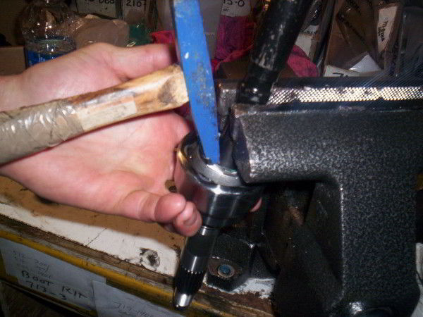
                Tap the race with a tac hammer
            

        </td>
    </tr>
</table>

---

### Inner CV Joint Disassembly

<table>
	<tr>
		<td>
        	<h4>Step 1</h4>
            To remove an inner CV joint from an CV axle, first cut off the old boot. If the boot is fine, and you want to reuse it, just pull it back towards the outer joint. After the boot is out of the way, clean any excess grease.
        </td><td>
        	

                
                CV joint with boot
            

        </td>
    </tr><tr>
		<td>
        	<h4>Step 2</h4>
            Once it is clean, you should be able to look inside the inner joint housing and see a "c" clip near the edge of the housing.
        </td><td>
        	

                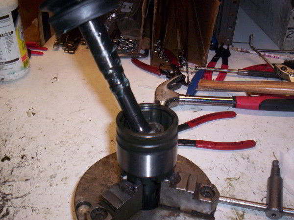
                Cleaned inner joint
            

        </td>
    </tr><tr>
		<td>
        	<h4>Step 3</h4>
            This can be removed by putting an utility knife or an flat head screw driver under the clip and flicking it off.
        </td><td>
        	

                
                C clip on inner joint
            

        </td>
    </tr><tr>
		<td>
        	<h4>Step 4</h4>
            Once the clip is removed, you can pull off the inner joint housing, and whats left on your shaft should be: the race, the cage, and the ball bearings.
        </td><td>
        	

                
                Removed shaft
            

        </td>
    </tr><tr>
		<td>
        	<h4>Step 5</h4>
            If you look at the top on the race, you'll see a retaining clip. If you have retaining clip pliers, this can be removed easily. Spread open the clip and remove it, that will allow you to remove the race, cage, and ball bearings off the shaft.
        </td><td>
        	

                
                Removed cage and race
            

        </td>
    </tr>
</table>

---

### Rebuilding a CV joint

1. Once you have disassembled the CV joint from the axle shaft, place it in a vice with the splined end facing down.
2. Degrease the old housing and then look for contact wear in the area where the ball moves back and forth in the grooves. Housing wear is normal and increases with mileage. Rebuilding should not be performed when the wear pattern becomes extreme.
3. If you are reusing any part of the old race, cage, or ball bearings degrease them and also look for any wear, dimples, or pitting. You can check the cage for cracks by dropping the cage on a hard surface. It should make a pinging sound, if not look closely for a crack.
4. To reassemble the CV joint, place the race back into the cage. Align the race spherical lands with the cage windows.
5. Place the assembled cage and race back into the CV joint housing. For heavy duty units you want the thick side facing out
6. Now place one ball into the cage window and tap lightly on the cage while holding the race to keep it from moving out of position to make contact with the ball.
7. Once the ball is down into the track tap lightly on the cage and race toward the side of that ball to expose the next window and repeat the process until all of the balls are installed.
8. Remove the clip from the axle shaft and place the shaft into the CV joint
9. Rotate the axle shaft around (no more than a 30 angle) to check for the smoothness of operation in the CV joint.
10. Twist the shaft from side to side to check for looseness. It may have a little play just nothing excessive.
11. Remove the axle shaft.
12. Cut the corner of the grease packet and make it like a bakers bag.
13. Press the cut corner of the grease packet tightly into the hole were the axle shaft will go.
14. Squeeze until you see grease come up around the balls then set the packet aside for the next procedure.
15. Install the clip back on the axle shaft and place the boot for the CV joint onto the shaft. Slide the boot down to the other joint, so it is out of the way.
16. Place the axle shaft back into the CV joint by lining up the splines of the shaft with the ones on the CV joint and press downward. You'll want to use a screwdriver to push the clip inward while pressing down to get it centered.
17. Now give the shaft a light tap with a soft hammer and the shaft should slide in easily until you feel the clip catch. It's a good idea to try to pull the shaft out to make sure it securely seated correctly inside the CV joint.
18. Take the remaining grease and make a bead around the top of the joint, similar to how an ice cream cone is shaped.
19. Now slide the boot down and tighten the large clamp.
20. Before you tighten the small clamp, put a screw driver in between the shaft and the boot to allow any trapped air to escape then remove it and install the small clamp.
21. If replacing the other CV joint, repeat the above steps for it. Otherwise, the axle is ready to be put back into the vehicle.

---

### ATV CV Axle removal and disassembly video

<iframe width="640" height="360" src="https://www.youtube.com/embed/OQ84_YJYEg8?rel=0" frameborder="0" allowfullscreen></iframe>

---

### Disassembly of a "Non-Rebuildable" U-Joint

<table>
	<tr>
		<td>
        	<h4>Step 1</h4>
            Use a press or hammer to force the bearing cap out of the staked ear hold. This may require considerable force, but be careful not to damage the ear holes or bend the yoke or flange ears.
        </td><td>
        	

                
                
            

        </td>
    </tr><tr>
		<td>
        	<h4>Step 2</h4>
            Use a vise or pliers to remove the bearing cap which is exposed on the opposite side. Twisting the pliers back and forth while pulling may help unseat the cap.
        </td><td>
        	

                
                
            

        </td>
    </tr><tr>
		<td>
        	<h4>Step 3</h4>
			Use a small grinding wheel to smooth the staked ear hole on the driven side in order to make the removal of the opposite bearing cap easier.  

			Repeat the above steps to remove the remaining bearing caps. Once all the caps are removed, discard the used joint.  

			Inspect the yoke and flange for damage, cleaning out the remaining staked tabs and any excessive burs. This will help make installing the new caps easy.
        </td><td>
        	

                
                
            

        </td>
    </tr>
</table>

---

### Installation of a "Non-Rebuildable" U-Joint

<table>
	<tr>
		<td>
        	<h4>Step 1</h4>
            Press the new U-Joint and bearing caps into position and insert the "C" clip
        </td><td>
        	

                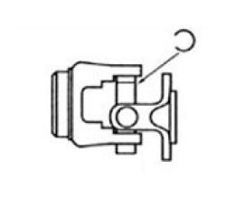
                
            

        </td>
    </tr><tr>
		<td>
        	<h4>Step 2</h4>
            Use a press or hammer to expose the opposite slot, then insert the second clip.  
			Repeat the above steps for the remaining clips.  
			Make sure all the clips are completely seated into the groove of the new bearing caps
        </td><td>
        	

                
                
            

        </td>
    </tr>
</table>
