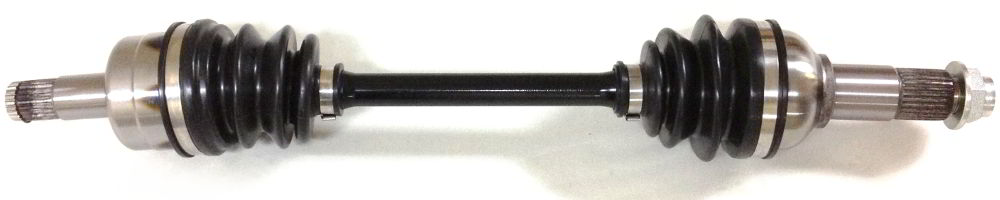
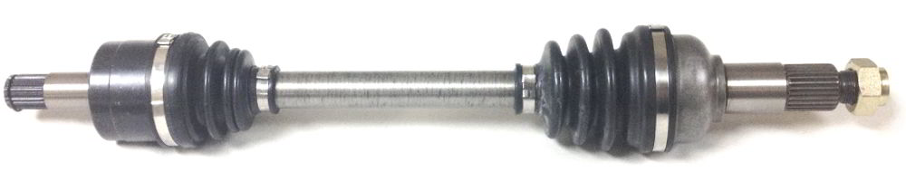
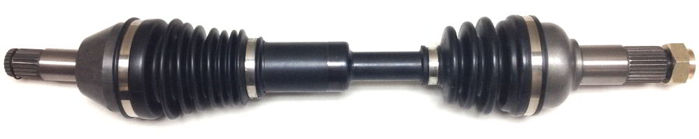
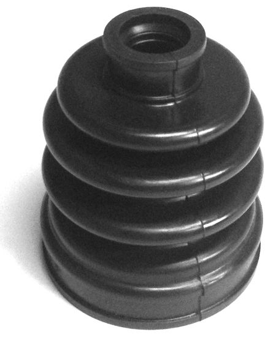
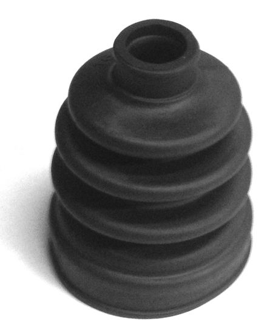

## Constant Velocity Axles

Our aftermarket constant velocity axles are designed to be a direct replacement for your ATV's stock axles. They are designed to meet or exceed OEM specifications. We offer three grades of axles: O.E. Type, Heavy Duty, and Monster Extreme Performance.

### Original Equipment Series
<!-- axle_oe.jpg = YA-8-300 -->

    
    OE series

Original Equipment Type: meets or exceeds OEM specifications.

* Designed for stock suspensions only
* Quality neoprene rubber CV boots
* Ideal for anyone looking for low cost / high quality

### Heavy Duty Series

<!-- axle_hd.jpg = B110 -->

    
    HD series

Heavy Duty: designed for rough terrain.

* Designed for stock suspensions only
* Thicker (nearly 1 inch thick) 43/40 chromoly steel axle shaft
* Superior quality thermoplastic type CV boots
* Designed for encountering sticks, rocks, and debris when off-roading

&#10033; **See what others are saying!** Read the HD series&#42; axle review from [WeekendATV](http://weekendatv.com/2011/12/review-monster-axles/) &lsaquo;[Mirror](./?review-weekendatv)&rsaquo; 

&#42; *Note that the HD series was formerly known as "Monster Axles"*

### Monster XP Series

<!-- axle_xp.jpg = XB-110 -->

    
    Monster XP series

Monster Extreme Performance: designed for high performance lifted vehicles. <!-- TODO: To see the benefits and technology [click here](./?p=products-xp-series). -->

* Works with lift kits up to 4 inches
* Larger, stronger, and more durable 43/40 chromoly steel axle shaft
* Puncture resistant material with a multi-rib design CV boots
* Designed for high powered, highly modified, mud racing ATVs

&#10033; **See what others are saying!** Read the XP series axle review from [ATV-UTVTECH](./?review-atv-utvtech) &lsaquo;originally on atv-utvtech.com&rsaquo;

---

## CV Axle Boot Kits

All of our boot kits come with the boot, packet of moly grease, and two pinch type bands. At the customer's request, the pinch type bands can be substituted with a band type band that needs a seperate banding tool.

    
    OE series

    
    HD series

### Original Equipment Series

The Original Equipment Series boots are injection molded to OEM specifications

* Made out of neoprene rubber
* Designed to meet or exceed OEM specifications

### Heavy Duty Series 

The Heavy Duty Series boots are made in the USA and suggested for vehicles that go off road.

* Made out of thermoplastic type rubber
* Designed to be more durable and puncture resistant to sticks, brush, and rocks

---

## ATV / Snowmobile Drive Belts

Gates G-Force belts are engineered for a precise fit with drop-in performance and durability to meet the demands of today’s and tomorrow’s powersports equipment.

### G-Force

Gates G-Force belts are the product of continuous evolution in CVT belt technology. As the first of a new generation of double-cog CVT belts, G-Force belts are designed for superior performance and durability.

The parts that make up a G-Force belt from top to bottom are:

* Trapezoidal Top Cog Design
* Adhesion Gum
* Tensile Cord
* Fiber Loaded Rubber
* Bottom Cog Jacket

### G-Force C12

As the first CVT belt to utilize a carbon tensile cord, Gates G-Force C12 belt combines minimal stretch and extraordinary strength. The cords are bonded to a specially formulated adhesion gum with aramid fiber loaded rubber, which results in increased side-load resistance, preventing belt distortion and edge cord pullout.

The parts that make up a G-Force C12 belt from top to bottom are:

* Trapezoidal Top Cog Design
* Specially Formulated Adhesion Gum
* Carbon Tensile Cord
* Aramid Fiber Loaded Rubber
* Cloth-infused Rounded Bottom Cog

---

## Helmets &amp; Protective Gear

Kali Protective's gear comes in a variety of designs and are manufactured with a variety of composite materials such as contego, fiberglass, and kevlar. They are DOT certified for use on the roads as well as meeting many racing standards.

Some products we carry are:

* ATV / Dirt Bike Helmets
* Motorcycle / Street Helmets
* Body Armor
* Knee Guards
* Shin Guards